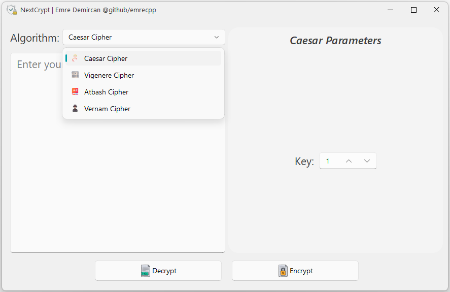
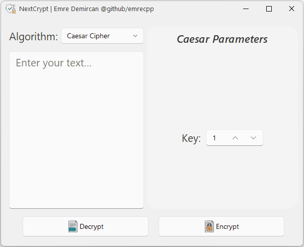

<p align="center">
  
</p>
  <h1 align="center">
  Next Crypt
</h1>
<p align="center">
  NextCrypt is a Python application featuring a Qt interface with animations, designed to perform encryption and decryption using algorithms such as Caesar, Vigenere, Atbash, and Vernam.
</p>

<p align="center">

  <a style="text-decoration:none">
    
  </a>

  <a style="text-decoration:none">
    
  </a>

  <a style="text-decoration:none">
    
  </a>
</p>
<div align="center">
  
</div>

## Demo
<div align="center">
  
  

</div>

## Supported Ciphers
* Caesar
* Vigenere
* Atbash
* Vernam

## Quick start
1. Install dependencies:

    ```shell
    pip install -r requirements.txt
    ```

2. Run the GUI:
      ```shell
    python MainGUI.py
    ```

## See also
- [zhiyiYo/PySide-Fluent-Widgets](https://github.com/zhiyiYo/PyQt-Fluent-Widgets/tree/PySide6)：A fluent design widgets library based on PySide6

## License

NextCrypt is licensed under MIT

Copyright © 2023 by emrecpp


## ⭐ If you liked my project, please don't forget to star it ⭐ 
